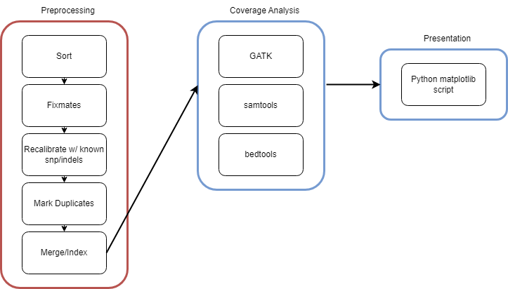

# Fulgent Genetics Bioinformatics Quiz
### Author: Joseph Powell

__Prompt__: "You get an NGS BAM file generated from whole genome sequencing (WGS) data aligned against the Genome in a Bottle (GIAB, NA12878/HG001) reference sample. The BAM file contains aligned reads from the sequencing process. Each read represents a fragment of DNA from the genome. The coverage at a specific genomic position is defined as the number of reads that overlap that position.

Please calculate the coverage(sequencing depth) for the given NA12878 BAM (https://www.internationalgenome.org/data-portal/sample/NA12878) file aligned against GRCH38 reference sequence. You are free to pick up tools for your analyses. Please design your approach and algorithm BEFORE you start. You can define the targets(bed files) for your coverage analysis. Please do ask questions if needed.

We suggest preparing a one-page design document.

Please write your own executable code, if possible. Pseudo-code is also acceptable, and you can explain during the follow-up interviews.

Source code will be checked into your repo on github, with a readme.

You should not take more than 2-3 hours on this task, and you have 3 calendar days to turn in this assignment"

## Process
The first step that I took is to make sure that I have a reproducible environment that I can use and can be used by anyone on any machine. I took the following steps to make sure that I had everything that I needed set up before I started running any scripts

```
cd ~PATH/gatk-4.6.0.0/
conda env create -n fulgent_gatk -f gatkcondaenv.yml
source activate fulgent_gatk 
```

However, for other tools used in this example, such as gatk, samtools, and bedtools, it is assummed that those tools are installed and are available in the user's current PATH.

Given that information, I have designed the following simple workflow below to go from an aligned BAM file to a presentation on the read coverage for this sample.



### Part 1:
As the prompt indicates we are at a point where we can assume that the BAM file has already been aligned to the GRCH38 human reference genome using some alginment tool, such as the BWA-MEM algorithm. This indicates that the next immediate step for us is to Sort, Merge, and Deduplicate our sample.

### Part 2:
After de-duplication, we can move on to finding the coverage of our sample. There are many tools that can be used to do this so lets compare a few of them. In the interest of time I've chosen, the GATK Depth tool, samtools, and bedtools. Additionally, just for fun, I've run `bedtools genomecov` to show regions in this sample with exceptionally low coverage.

### Part 3:
Finally, I've made a simple python script that looks at the output of all of the coverage tools and plots them against one another.

### Conclusion
All parts of this script can be invoked with the following bash command: 

`bash wgs_bam_coverage.sh <input_sample> <reference>`
